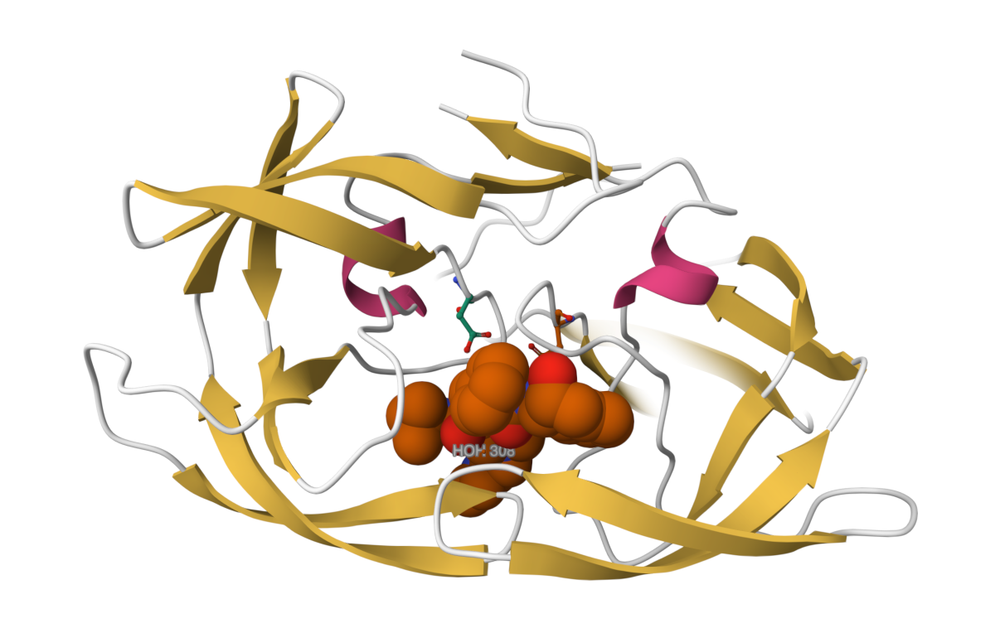
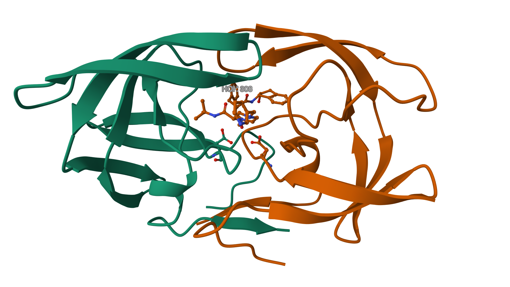
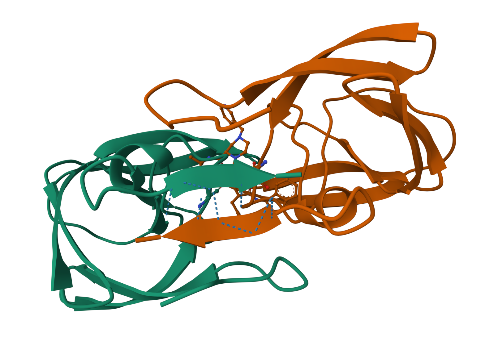
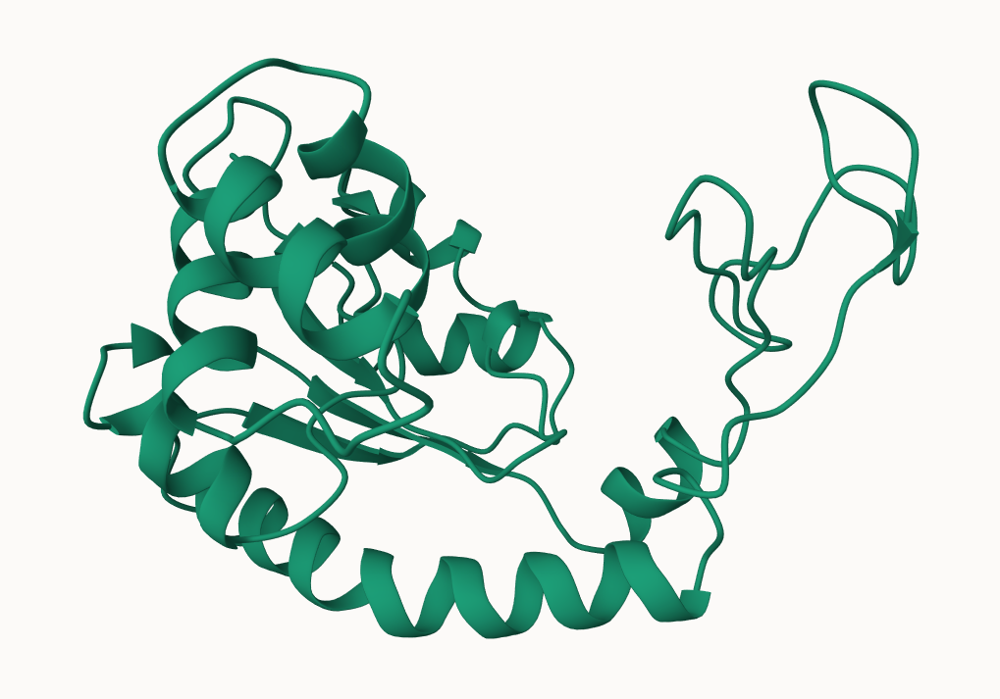
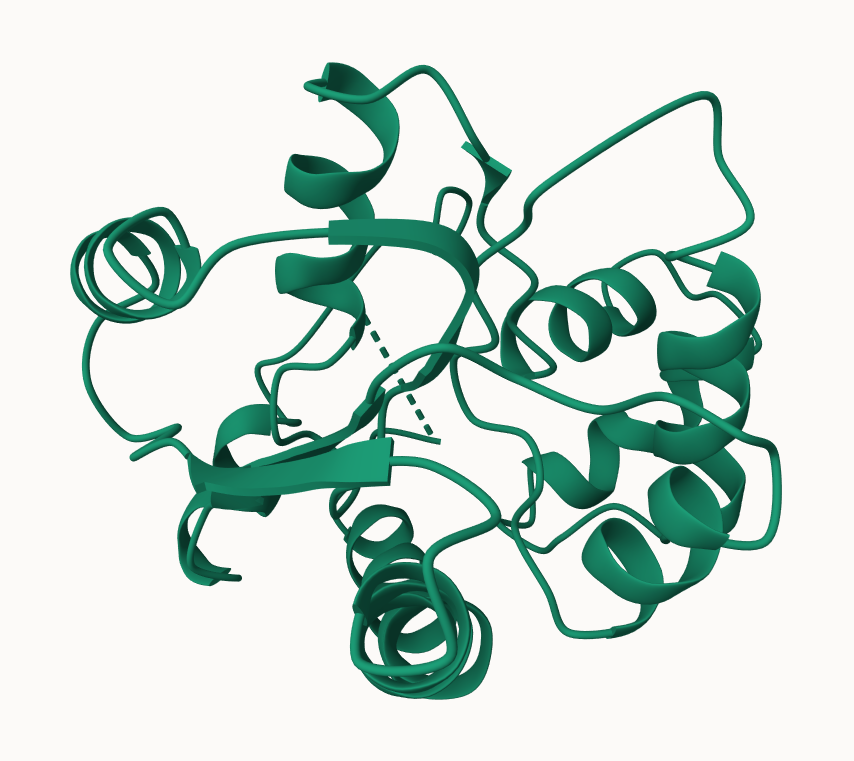

## 2. Intro to RCSB PDB

### PDB Statistics:

```{r}
stats <- read.csv("pdb_stats.csv")
```

> **Q1: What percentage of structures in the PDB are solved by X-Ray and Electron Microscopy.**

```{r}
library(dplyr)
stats.summarized <- stats %>% 
  summarize(X.ray = sum(X.ray), EM = sum(EM), Total = sum(Total))

Ans1 <- (stats.summarized$X.ray + 
           stats.summarized$EM)/stats.summarized$Total * 100
Ans1
```

> 93.7892% are solved by X-ray or EM.

> **Q2: What proportion of structures in the PDB are protein?**

```{r}
Ans2 <- sum(c(stats[1, "Total"], stats[2, "Total"], stats[3, "Total"])
            )/stats.summarized$Total * 100
Ans2
```

> 97.9118% of structures in the PDB are proteins, including protein only, protein-oligosaccharide, and protein-nucleic acid.

> **Q3: Type HIV in the PDB website search box on the home page and determine how many HIV-1 protease structures are in the current PDB?**
>
> There were 1,227 Structures when "HIV-1 Protease" was used as the query.

## 3. Visualizing the HIV-1 protease structure

### Using Mol\*



### Delving Deeper

> **Q4: Water molecules normally have 3 atoms. Why do we see just one atom per water molecule in this structure?**
>
> Hydrogens are probably too small to resolve using X-ray crystallography on their own, and in all these structures they appear bound to another, larger atom - usually oxygen or nitrogen. In the water molecules, we only see one atom for the same reason. This actually represents an oxygen bound to two hydrogens, but the hydrogens are too small to resolve from the mugh larger (in comparison to the hydrogen) central oxygen.

> **Q5: There is a critical “conserved” water molecule in the binding site. Can you identify this water molecule? What residue number does this water molecule have?**
>
> Yes, the water molecule was HOH 308 and coordinates with the ligand.

> **Q6: Generate and save a figure clearly showing the two distinct chains of HIV-protease along with the ligand. You might also consider showing the catalytic residues ASP 25 in each chain and the critical water (we recommend “Ball & Stick” for these side-chains). Add this figure to your Quarto document.**
>
> 

> **\[Optional\] As you have hopefully observed HIV protease is a homodimer (i.e. it is composed of two identical chains). With the aid of the graphic display can you identify secondary structure elements that are likely to only form in the dimer rather than the monomer?**
>
> The antiparallel beta-sheet between the C-terminals of both chains, specifically residues T96, L97, and N98, as seen in the figure below.
>
> 

## 4. Intro to Bio3D in R

```{r}
library(bio3d)
```

### Reading in the PDB file data

```{r}
pdb <- read.pdb("1hsg")
pdb
```

> **Q7: How many amino acid residues are there in this pdb object?**
>
> 198

> **Q8: Name one of the two non-protein residues?**
>
> HOH

> **Q9: How many protein chains are in this structure?**
>
> 2

```{r}
attributes(pdb)
head(pdb$atom)
```

### Quick PDB visualization in R

```{r}
library(bio3dview)
library(NGLVieweR)

view.pdb(pdb) %>% setSpin()
```

```{r}
select <- atom.select(pdb, resno = 25)

view.pdb(pdb, cols = c("navy", "teal"), 
         highlight = select, 
         highlight.style = "spacefill") %>%
  setRock()
```

### Predicting functional motions of a single structure

```{r}
adk <- read.pdb("6S36")
adk
```

Performing flexibility prediction - Normal Mode Analysis (NMA)

```{r}
m <- nma(adk)
plot(m)
```

Making a "movie" of the predictions using molecular trajectiory - mktrj()

```{r}
mktrj(m, file = "adk_m7.pdb")
```

```{r}
view.nma(m, pdb = adk)
```



## 5. Comparative structure analysis of Adenylate Kinase

> **Q10. Which of the packages above is found only on BioConductor and not CRAN?**
>
> msa

> **Q11. Which of the above packages is not found on BioConductor or CRAN?:**
>
> bio3dview

> **Q12. True or False? Functions from the pak package can be used to install packages from GitHub and BitBucket?**
>
> TRUE

### Search and Retrieve ADK Structures

```{r}
aa <- get.seq("1ake_a")
aa
```

> **Q13. How many amino acids are in this sequence, i.e. how long is this sequence?**
>
> 214

BLAST Search

```{r}
b <- blast.pdb(aa)
```

```{r}
hits <- plot.blast(b)
head(hits)
```

Downloading the files:

```{r}
files <- get.pdb(hits$pdb.id, path = "pdbs", split = TRUE, gzip = TRUE)
```

### Aligning and Superposing structures:

Using pdb align - pdbaln()

```{r}
pdbs <- pdbaln(files, fit = T, exefile = "msa")
```

### Optional: Viewing our superposed structures

> Note that this was created with 20 IDs found via a blast search, rather than the 13 that were pre-provided.

```{r}
view.pdbs(pdbs, colorScheme = "residueIndex")
```

### Annotate collected PDB structures

> Note that this was created with 20 IDs found via a blast search, rather than the 13 that were pre-provided.

```{r}
ids <- basename.pdb(pdbs$id)

anno <- pdb.annotate(ids)
unique(anno$source)
```

```{r}
head(anno)
```

### PCA

> Note that this was created with 20 IDs found via a blast search, rather than the 13 that were pre-provided.

```{r}
pc.xray <- pca(pdbs)
plot(pc.xray)
```

Calculating rmsd:

> Note that this was created with 20 IDs found via a blast search, rather than the 13 that were pre-provided.

```{r}
rd <- rmsd(pdbs)

hc.rd <- hclust(dist(rd))
grps.rd <- cutree(hc.rd, k = 3)

plot(pc.xray, 1:2,col = "steelblue2", bg = grps.rd, pch = 21, cex = 1)
```

### PCA Visualization

> Note that this was created with 20 IDs found via a blast search, rather than the 13 that were pre-provided.

```{r}
pc1 <- mktrj(pc.xray, pc = 1, file = "pc1.pdb")
```



### Plotting with ggplot

> Note that this was created with 20 IDs found via a blast search, rather than the 13 that were pre-provided.

```{r}
library(ggplot2)
library(ggrepel)

df <- data.frame(PC1 = pc.xray$z[ , 1], 
                 PC2 = pc.xray$z[ , 2], 
                 color = as.factor(grps.rd), 
                 ids = ids)

p <- ggplot(df) + 
  aes(PC1, PC2, col = color, label = ids) + 
  geom_point(size = 2) + 
  geom_text_repel(max.overlaps = 20) + 
  theme_bw() + 
  theme(legend.position = "none")
p
```

## 6. Normal mode analysis \[optional\]

NMA of all structures: \> Note that this was created with 20 IDs found via a blast search, rather than the 13 that were pre-provided.

```{r}
modes <- nma(pdbs)
plot(modes, pdbs, col = grps.rd)
```

> **Q14. What do you note about this plot? Are the black and colored lines similar or different? Where do you think they differ most and why?**
>
> The black and colored lines occur at similar amino acid positions but differ greatly in relative fluctuations. They differ most around amino acid position \~55, and \~150. This probably represents two distinct binding domains that are flexible to allow for induced fit of the target ligand.
