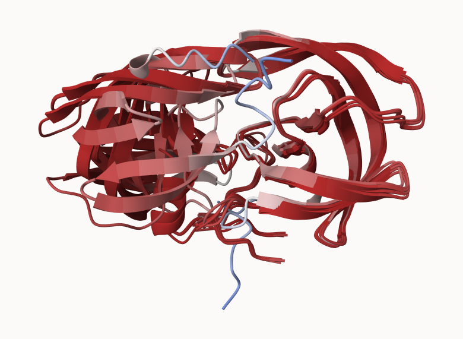
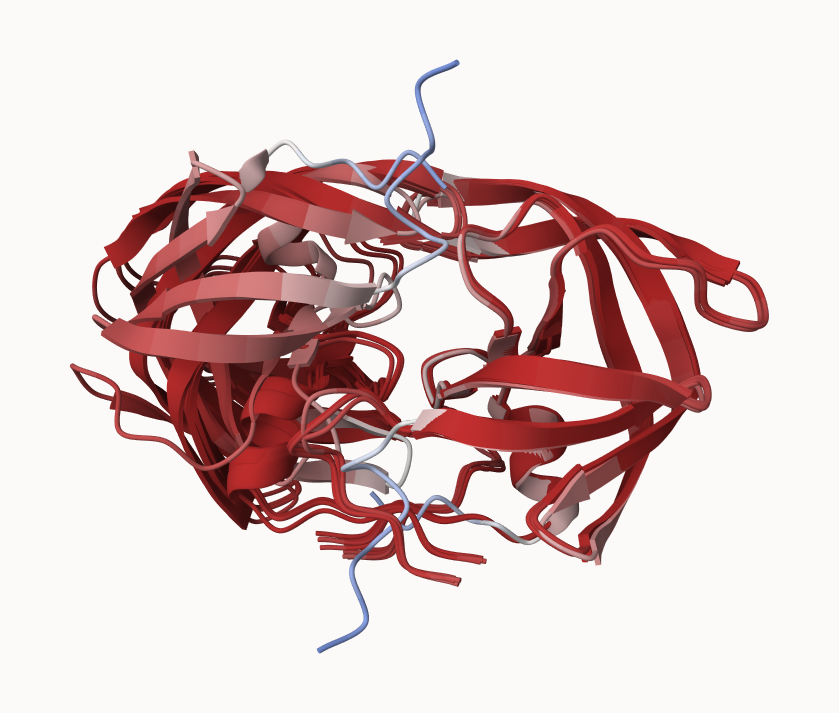
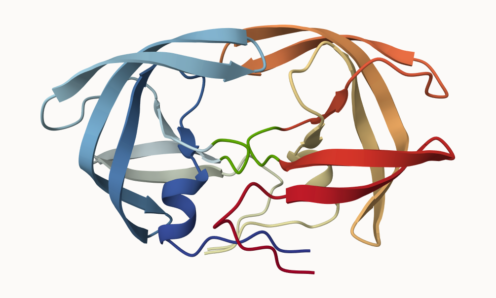

Figure 18:



## 8. Custom analysis of resulting models

```{r}
results_dir <- "hivprhomodimer_23119"
pdb_files <- list.files(path=results_dir,
                        pattern="*.pdb",
                        full.names = TRUE)

# Print our PDB file names
basename(pdb_files)
```

```{r}
library(bio3d)

pdbs <- pdbaln(pdb_files, fit = TRUE, exefile = "msa")
pdbs
```

```{r}
rd <- rmsd(pdbs, fit = T)
range(rd)
```

```{r}
library(pheatmap)
colnames(rd) <- paste0("m", 1:5)
rownames(rd) <- paste0("m", 1:5)
pheatmap(rd)

```

```{r}
pdb <- read.pdb("1hsg")
```

```{r}
plotb3(pdbs$b[1, ], type = "l", lwd = 2, sse= pdb)
points(pdbs$b[2, ], type = "l", col = "red")
points(pdbs$b[3, ], type = "l", col = "blue")
points(pdbs$b[4, ], type = "l", col = "green4")
points(pdbs$b[5, ], type = "l", col = "orange")
abline(v = 100, col = "grey")
```

Finding the core:

```{r}
core <- core.find(pdbs)
```

```{r}
core.inds <- print(core, vol= 0.5)
xyz <- pdbfit(pdbs, core.inds, outpath = "corefit_structures")
```



Examining RMSF

```{r}
rf <- rmsf(xyz)
plotb3(rf, sse = pdb)
abline(v = 100, col = "gray", ylab = "RMSF")
```

### Predicted Alignment Error for domains

```{r}
library(jsonlite)
pae_files <- list.files(path = results_dir, 
                        pattern = ".*model.*\\.json",
                        full.names = TRUE)
```

```{r}
pae1 <- read_json(pae_files[1], simplifyVector = TRUE)
pae5 <- read_json(pae_files[5], simplifyVector = TRUE)

attributes(pae1)
head(pae1$plddt)
pae1$max_pae
pae5$max_pae
```

```{r}
plot.dmat(pae1$pae, 
          xlab = "Residue Position (i)",
          ylab = "Residue Position (j)")
```

```{r}
plot.dmat(pae5$pae, 
          xlab="Residue Position (i)",
          ylab="Residue Position (j)",
          grid.col = "black",
          zlim=c(0,30))
```

```{r}
plot.dmat(pae1$pae, 
          xlab="Residue Position (i)",
          ylab="Residue Position (j)",
          grid.col = "black",
          zlim=c(0,30))
```

### Residue conservation from alignment file

```{r}
aln_file <- list.files(path=results_dir,
                       pattern=".a3m$",
                        full.names = TRUE)
aln_file
```

```{r}
aln <- read.fasta(aln_file[1], to.upper = TRUE)
```

```{r}
dim(aln$ali)
```

```{r}
sim <- conserv(aln)
```

```{r}
plotb3(sim[1:99], sse=trim.pdb(pdb, chain="A"),
       ylab="Conservation Score")
```

```{r}
con <- consensus(aln, cutoff = 0.9)
con$seq
```

```{r}
m1.pdb <- read.pdb(pdb_files[1])
occ <- vec2resno(c(sim[1:99], sim[1:99]), m1.pdb$atom$resno)
write.pdb(m1.pdb, o=occ, file="m1_conserv.pdb")
```


